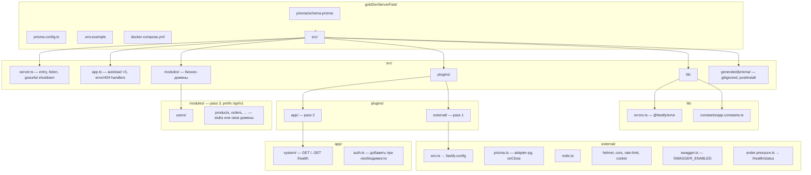

# Fastify API Skeleton

Точка отсчёта для новых бэкендов на **Fastify 5**, **TypeScript (ESM)**, **Prisma 7**, **Redis**.
Подробности запуска — [README.md](./README.md), архитектура — [ARCHITECTURE.md](./ARCHITECTURE.md).

---

## Структура папок



```text
goldZenServerFast/
├── prisma/
│   └── schema.prisma
├── prisma.config.ts
├── src/
│   ├── server.ts                 # bootstrap
│   ├── app.ts                    # composition root
│   ├── lib/
│   │   ├── errors.ts
│   │   └── constants/
│   ├── generated/prisma/         # prisma generate (не в git)
│   ├── plugins/
│   │   ├── external/             # pass 1: infra + security
│   │   │   ├── env.ts
│   │   │   ├── prisma.ts
│   │   │   ├── redis.ts
│   │   │   ├── sensible.ts
│   │   │   ├── cookie.ts
│   │   │   ├── cors.ts
│   │   │   ├── helmet.ts
│   │   │   ├── rate-limit.ts
│   │   │   ├── swagger.ts
│   │   │   └── under-pressure.ts
│   │   └── app/                  # pass 2: cross-cutting, без /api/v1
│   │       └── system/
│   │           ├── index.ts
│   │           ├── handlers.ts
│   │           ├── schemas.ts
│   │           └── health.service.ts
│   └── modules/                  # pass 3: /api/v1/<feature>/
│       └── <feature>/
│           ├── index.ts          # единственная точка autoload
│           ├── routes.ts         # по мере роста
│           ├── handlers.ts
│           ├── service.ts
│           ├── schema.ts
│           ├── types.ts
│           ├── repository.ts     # опционально
│           └── _autohooks.ts     # опционально
├── README.md
├── ARCHITECTURE.md
└── SKELETON.md                   # этот файл
```

---

## Ядро скелета (не выкидывать без причины)

### Три прохода `@fastify/autoload`

Порядок в `src/app.ts` **фиксирован**:

| Pass | Папка | Назначение |
|------|--------|------------|
| 1 | `plugins/external/` | env, DB, cache, security, swagger, under-pressure |
| 2 | `plugins/app/` | инфра на корне приложения (`/`, `/health`, будущий auth) |
| 3 | `modules/` | бизнес API под `prefix: '/api/v1'` |

**Autoload-опции для modules (pass 3):**

- `indexPattern: /^index\.(ts|js)$/` — плагином регистрируется только `index.ts`; `service.ts`, `repository.ts`, `schema.ts` не подхватываются autoload.
- `dirNameRoutePrefix: true` — имя папки = сегмент URL (`users/` → `/api/v1/users`).
- `autoHooks: true` + `cascadeHooks: true` — `_autohooks.ts` в модуле вешает hooks на все маршруты модуля.

### Разделение слоёв

| Слой | Что кладём |
|------|------------|
| `plugins/external/` | сторонние плагины, декораторы `fastify.prisma`, `fastify.redis`, `fastify.config` |
| `plugins/app/` | cross-cutting без версии API: health, authenticate, глобальные decorators |
| `modules/` | vertical slices: routes → handlers → service (+ repository при необходимости) |

Маршруты в `plugins/app/` живут **вне** `/api/v1`. Бизнес — только в `modules/`.

### Ошибки

- `src/lib/errors.ts` — типизированные ошибки (`NotFoundError`, `ConflictError`, …) через `@fastify/error`.
- `src/app.ts` — единый `setErrorHandler`: AJV → 400, `statusCode` сохраняется, 5xx маскируются вне dev.

В модуле: `throw new NotFoundError('User')` или `reply.notFound()` из `@fastify/sensible`.

### Prisma 7

- `plugins/external/prisma.ts`: singleton `PrismaClient` + `@prisma/adapter-pg`, `$disconnect` в `onClose`.
- Client в `src/generated/prisma/` (генерация: `postinstall` / `npm run prisma:generate`).
- URL и migrations — в `prisma.config.ts`, не в `schema.prisma`.

### `fastify-plugin` и `dependencies`

Плагины, которые читают `fastify.config` при регистрации (cookie, cors, swagger, prisma), оборачиваются в `fp()` с `dependencies: ['@fastify/env']`, чтобы autoload поднял env раньше.

System plugin: `prefixOverride = ''`, чтобы autoload не смонтировал его на `/system`.

### TypeBox

- `@fastify/type-provider-typebox` + `@sinclair/typebox` в route `schema` (body, params, response).
- Типы request/reply выводятся из схем.

### Rate-limited 404

`setNotFoundHandler` с `rateLimit({ max: 3, timeWindow: 500 })` — усложняет перебор URL (паттерн fastify/demo).

### Логирование

- TTY → `pino-pretty`.
- non-TTY (контейнер) → JSON + **redact** authorization, cookie, password, token, secret (`server.ts`).

### Правила между модулями

**Разрешено:**

- `fastify.prisma`, `fastify.redis`, `fastify.config`
- `src/lib/errors.ts`, `src/shared/*` (когда появится)
- decorators из `plugins/app/` (например `fastify.authenticate`)

**Запрещено:**

- import `service.ts` / `repository.ts` **другого** модуля
- cross-module бизнес-логика через import — только events, queues или decorator в `plugins/app/`

**`repository.ts`** — не обязателен; для thin CRUD достаточно `service.ts` + `fastify.prisma.<model>`.

**`shared/`** — только если код переиспользуется **≥ 3** модулями; иначе держать внутри своего модуля.

---

## Инфра-эндпоинты (как в коде сейчас)

| Method | URL | Назначение |
|--------|-----|------------|
| GET | `/` | баннер сервиса |
| GET | `/health` | readiness (PostgreSQL + Redis) |
| GET | `/health/status` | under-pressure |
| GET | `/api/docs` | Swagger UI при `SWAGGER_ENABLED=true` |
| GET | `/api/v1/<module>/` | бизнес-модули (stubs в Goldzen) |

---

## Инструкция: новый проект из скелета

### 1. Клонировать / скопировать репозиторий

```bash
cp -R goldZenServerFast my-new-api
cd my-new-api
```

Удалить `.git` при необходимости и инициализировать свой репозиторий.

### 2. Переименовать проект

- `package.json` → `name`, `description`
- OpenAPI title в `plugins/external/swagger.ts`
- баннер в `plugins/app/system/handlers.ts`
- имена контейнеров в `docker-compose.yml` (если используете)

### 3. Окружение

```bash
cp .env.example .env   # когда файл появится в репо
```

Минимум: `DATABASE_URL`, `REDIS_URL`, `COOKIE_SECRET` (≥ 32 символа), `CORS_ORIGINS`.

Для локальной документации API: `SWAGGER_ENABLED=true`.

### 4. Зависимости и Prisma

```bash
npm install
docker compose up -d    # postgres + redis
npm run prisma:migrate  # после появления моделей в schema
npm run dev
```

### 5. Убрать доменные заглушки Goldzen (по желанию)

Удалить ненужные папки в `src/modules/` (`users`, `products`, `orders`, `chat`, `payments`) или заменить одним эталонным `example/`.

Новый модуль = новая папка + `index.ts` — **в `app.ts` ничего не добавлять**.

### 6. Развить модуль по мере роста

```text
modules/<feature>/
├── index.ts       # export default plugin
├── routes.ts
├── handlers.ts
├── service.ts
├── schema.ts
├── types.ts
├── repository.ts  # опционально
└── _autohooks.ts  # опционально (auth на весь модуль)
```

### 7. Auth (когда понадобится)

1. `plugins/app/auth.ts` — `fastify.authenticate`, `request.user`.
2. `modules/auth/` или hooks в `_autohooks.ts` целевых модулей.
3. Не тянуть JWT/session в `external/` без необходимости — это app-level concern.

### 8. Соглашения при разработке

- Конфиг фич — **явные env-флаги** в `fastify.config`, не разбросанные проверки `NODE_ENV` (кроме маскировки 5xx / pretty logs).
- ESM: в TS-импортах `./file.ts`; после `tsc` — `.js` там, где требует NodeNext.
- Импорты между модулями — только через публичный API (decorator / events), не через `service` соседа.

### Checklist перед первым деплоем

- [ ] `NODE_ENV=production`
- [ ] `SWAGGER_ENABLED=false` (или не задавать)
- [ ] Секреты только в env, не в git
- [ ] `npm run build && npm start` проходит
- [ ] `GET /health` возвращает 200 при живых DB и Redis
- [ ] Миграции: `npm run prisma:deploy` в CI/CD

---

## На будущее (опционально)

| Добавление | Когда нужно |
|------------|-------------|
| BullMQ / `@fastify/schedule` | фоновые задачи, cron |
| `@fastify/jwt` или session plugin | почти всегда для API с auth |
| Structured request id (`@fastify/request-context`) | прод-логирование, трассировка запроса |
| OpenTelemetry | observability из коробки |
| Dockerfile + multi-stage | деплой в контейнер |
| vitest вместо `node:test` | если команда привыкла к Vitest |
| `.env.example` + CI (type-check, test) | шаблон для команды / open source |
| `GET /health/live` | liveness без проверки DB (k8s) |
| `modules/example/` | один эталонный модуль вместо product-specific stubs |
| `plugins/app/auth.ts` stub | старт auth без копипасты из старых проектов |

---

## Связанные документы

| Файл | Содержание |
|------|------------|
| [README.md](./README.md) | установка, env, таблица URL |
| [ARCHITECTURE.md](./ARCHITECTURE.md) | autoload, маппинг с Express, примеры кода |
| [src/modules/README.md](./src/modules/README.md) | layout модуля |
| [src/plugins/README.md](./src/plugins/README.md) | external vs app | 

